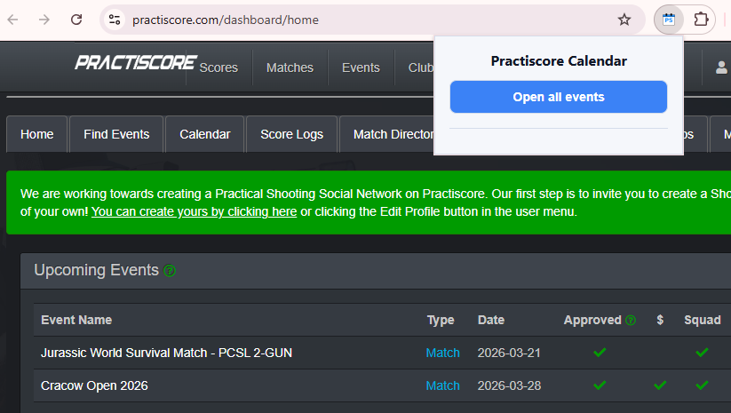
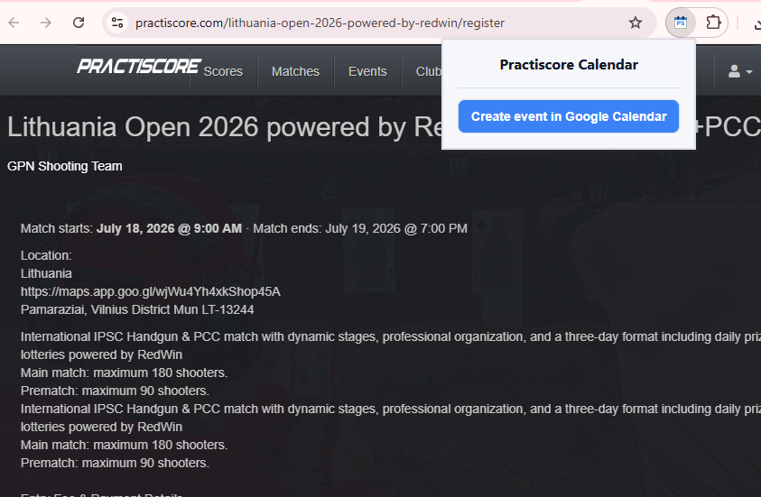
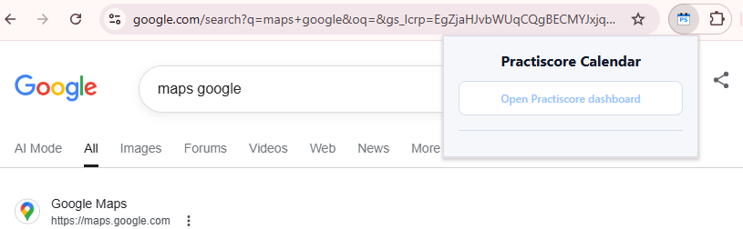
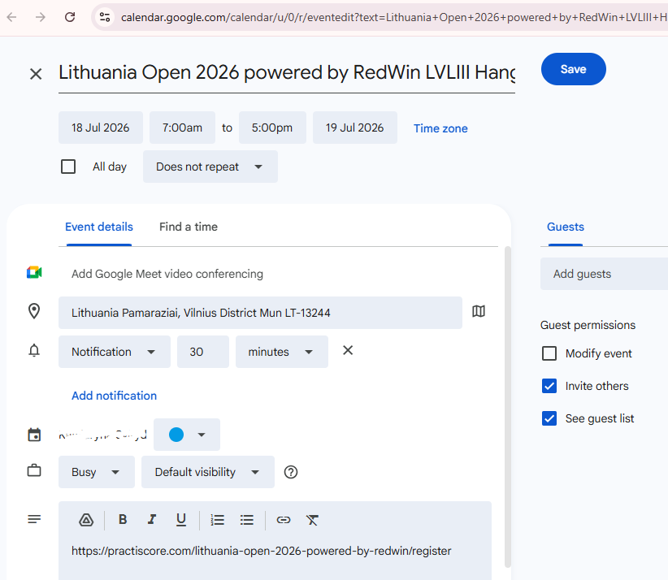

# PsCalendar

PsCalendar is a lightweight Chrome extension that streamlines adding PractiScore matches to Google Calendar.

From the PractiScore dashboard it opens all upcoming event registration pages, and from an event registration page it extracts the match name, dates, location, and registration URL to build a Google Calendar event in one click. The popup guides you to the PractiScore dashboard or event page and keeps the UI minimal for quick access.

## Use cases

### Logged in on the PractiScore dashboard

When you are logged in and on https://practiscore.com/dashboard/home, the popup shows the “Open all events” action. Clicking it opens each upcoming event’s registration page in new tabs so you can review them quickly.

### On an event registration page

When you are on a PractiScore event registration page (https://practiscore.com/<event-name>/register), the popup shows the “Create event in Google Calendar” action. It extracts the event name, start and end date/time, location, and registration URL, then opens a prefilled Google Calendar event.

### On any other page

If you are on any other page, the popup shows a link to open the PractiScore dashboard.

### Google Calendar event is generated

After you choose “Create event in Google Calendar,” a new tab opens with a prefilled Google Calendar event. It includes the event name, start/end times, location, and the PractiScore registration URL in the notes field so you can save the event immediately.

